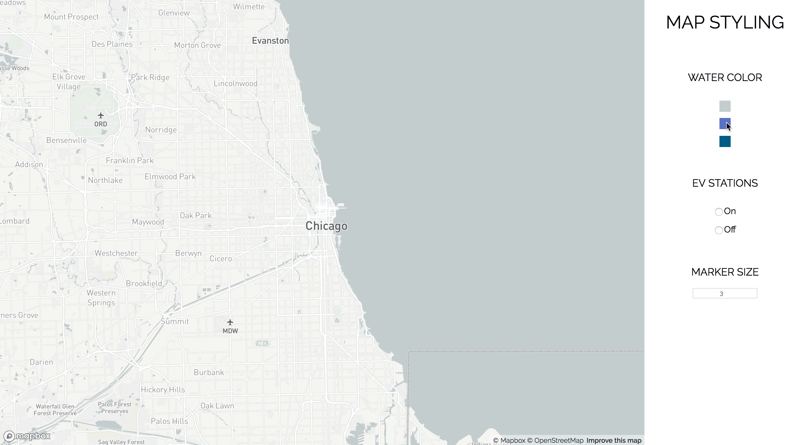

# Mapbox React Wrapper Component
The objective of this project was to build a simple React/Redux wrapper component around Mapbox. In order to demonstrate the process, I devised this simple example.



## Getting Started
```
npm install
npm start
```

## Built With
React
Redux
Mapbox

